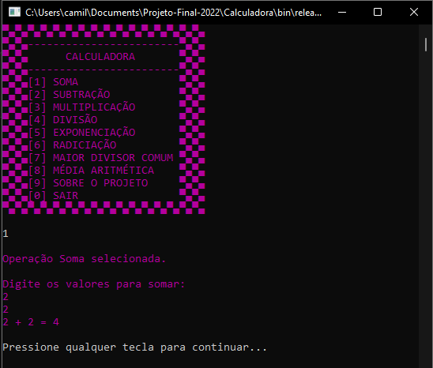
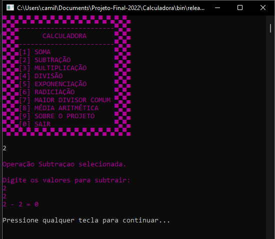
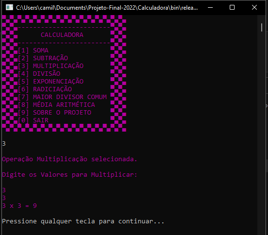
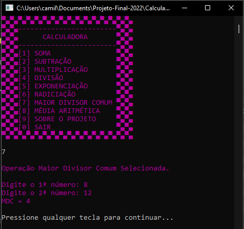

# Sobre o projeto

- Esse programa foi feito para o encerramento do primeiro módulo do curso de Informática.

- Consiste em uma calculadora de 8 operações: soma, subtração, multiplicação, divisão, exponenciação, radiciação, MDC e média aritmética. 

# Screenshots

### Tela inicial


### Soma



### Subtração


### Multiplicação


### Divisão


### Exponenciação


### Radiciação


### Maior Divisor Comum


### Média Aritmética


---

# Downloads

[Calculadora](dist/Projeto-Final-2022.zip)

[Dotnet Runtime](https://dotnet.microsoft.com/en-us/download)

Caso esteja usando Linux ou Mac, Execute utilizando o comando:

```dotnet Projeto-Final-2022.dll```


# Agradecimentos
- [Etec Adolpho Berezin](http://eteab.com.br/cms/)

- [Ermogenes Palacio](https://github.com/ermogenes)

- [Diego Neri](https://github.com/diegoneri)

---

Plágio é crime!


